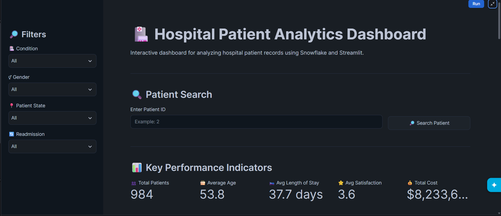

# 🏥 Hospital Patient Analytics

An interactive **Hospital Patient Analytics Dashboard** built using **Snowflake, Snowpark, SQL, Python, and Streamlit**.

This project analyzes hospital patient data stored in Snowflake and presents useful patient-level and analytical insights through an interactive Streamlit dashboard.

---

## 📌 Project Overview

Hospital data contains valuable information about patients, medical conditions, admissions, treatments, outcomes, and hospital stays.

The goal of this project is to use **Snowflake for data storage and processing** and **Streamlit for interactive visualization** to create a simple and user-friendly hospital analytics application.

The dashboard allows users to explore patient information and analyze important hospital-related data.

---

## 🎯 Project Objectives

- Store and manage hospital patient data using Snowflake.
- Perform data analysis using SQL.
- Connect Snowflake data with a Streamlit application.
- Provide an interactive dashboard for exploring patient information.
- Display patient-level details in an easy-to-understand format.
- Demonstrate the use of Snowpark with Streamlit.
- Build a practical data analytics project using cloud technologies.

---

## 🛠️ Technologies Used

| Technology | Purpose |
|------------|---------|
| **Snowflake** | Cloud data platform and data storage |
| **SQL** | Data creation, querying and analysis |
| **Python** | Application and data processing |
| **Snowpark** | Connecting Python applications with Snowflake |
| **Streamlit** | Interactive dashboard development |
| **Pandas** | Data manipulation and analysis |
| **Git & GitHub** | Version control and project management |

---

## 🏗️ Project Architecture

```text
                 ┌──────────────────────┐
                 │    Hospital Data     │
                 └──────────┬───────────┘
                            │
                            ▼
                 ┌──────────────────────┐
                 │      Snowflake       │
                 │                      │
                 │  Database & Tables   │
                 │       SQL            │
                 └──────────┬───────────┘
                            │
                            │ Snowpark
                            ▼
                 ┌──────────────────────┐
                 │      Python          │
                 │     Application      │
                 └──────────┬───────────┘
                            │
                            ▼
                 ┌──────────────────────┐
                 │      Streamlit       │
                 │     Dashboard        │
                 └──────────┬───────────┘
                            │
                            ▼
                 ┌──────────────────────┐
                 │ Interactive Patient  │
                 │      Analytics       │
                 └──────────────────────┘

📊 Patient Data

The hospital dataset contains information such as:

Patient ID
Age
Gender
Medical Condition
Medication
Admission Date
Discharge Date
Patient Status
Year of Admission
Length of Stay
Readmission
Outcome
Satisfaction
Insurance
Total Cost

These fields provide the foundation for patient-level exploration and hospital data analysis.

🚀 Dashboard Features
👤 Patient Profile

The dashboard provides a patient profile section where information related to a selected patient can be displayed.

The profile includes information such as:

Patient ID
Age
Gender
Medical Condition
Medication
Patient information
🔎 Patient Search

Users can search for a patient using the patient ID.

The application retrieves the corresponding information from Snowflake and presents it through the Streamlit interface.

Enter Patient ID
       ↓
Search Snowflake
       ↓
Retrieve Patient Data
       ↓
Display Patient Profile
📈 Patient Analytics

The application provides a dashboard interface for exploring hospital patient data.

The available patient data can be used to analyze areas such as:

Patient conditions
Patient demographics
Admissions
Length of stay
Readmissions
Patient outcomes
Satisfaction
Insurance information
Treatment costs
🗄️ Snowflake Integration

Snowflake acts as the primary data platform for the application.

The Streamlit application uses Snowpark to access the active Snowflake session.

Example:

from snowflake.snowpark.context import get_active_session

session = get_active_session()

The application can then execute SQL queries against the hospital patient data stored in Snowflake.

This approach allows the application to work with Snowflake data without requiring a separate traditional database server.

⚙️ How the Project Works
1. Data Storage

Hospital patient data is stored in Snowflake.

2. Database Setup

SQL is used to create the required database objects and patient table.

3. Snowflake Connection

The Streamlit application establishes a connection with the active Snowflake session using Snowpark.

4. Data Retrieval

SQL queries are executed to retrieve the required patient information.

5. Data Processing

Python and Pandas are used where required to work with the retrieved data.

6. Dashboard Presentation

Streamlit displays the information through an interactive dashboard.

📁 Project Structure
Hospital_Patient_Analytics/
│
├── README.md
│
├── hospital.sql
│
└── streamlit_app/
    │
    ├── .streamlit/
    │   └── config.toml
    │
    ├── pyproject.toml
    │
    ├── snowflake.yml
    │
    └── streamlit_app.py
📄 File Description
hospital.sql

Contains SQL statements for setting up the hospital analytics database environment and patient data table.

streamlit_app/streamlit_app.py

Main Python file containing the Streamlit dashboard application and Snowflake data access logic.

streamlit_app/.streamlit/config.toml

Contains Streamlit application configuration.

streamlit_app/pyproject.toml

Contains Python project configuration and project dependencies.

streamlit_app/snowflake.yml

Contains Snowflake project configuration.

README.md

Project documentation and information about the application.

🔄 Project Workflow
Hospital Patient Data
        │
        ▼
     Snowflake
        │
        ▼
    SQL Queries
        │
        ▼
     Snowpark
        │
        ▼
 Python / Streamlit
        │
        ▼
 Interactive Dashboard
        │
        ▼
 Patient Information
 & Analytics
💡 Key Learning Outcomes

This project provided practical experience in:

Cloud data platforms
Snowflake database management
SQL
Python programming
Snowpark
Streamlit
Data analysis
Interactive dashboard development
Git version control
GitHub repository management
Connecting cloud data with Python applications
🔮 Future Enhancements

The project can be further enhanced with:

📊 More interactive charts and visualizations
🔍 Advanced patient filtering
📅 Admission and discharge trend analysis
💰 Detailed hospital cost analysis
🔄 Readmission analysis
🤖 Machine learning-based patient outcome prediction
📈 Predictive healthcare analytics
🔐 Role-based access control
📑 Automated reporting
⚡ Automated data ingestion pipelines
📸 Dashboard Preview

Add screenshots of the completed dashboard here.

For example:



A screenshot helps visitors understand the project immediately without opening the application.

🔐 Security

No passwords, API keys, Personal Access Tokens, or other sensitive credentials should be stored in this repository.

Authentication credentials should be managed securely using Snowflake secrets or other appropriate secure authentication mechanisms.

👨‍💻 Author

Jayaseelan

Computer Science Engineering Student

⭐ Project Highlights
☁️ Cloud-based hospital analytics
🏥 Healthcare patient data analysis
❄️ Snowflake data platform
🐍 Python application
📊 Streamlit dashboard
🗄️ SQL data management
🔗 Snowpark integration
🌐 GitHub version control

## 📄 License

This project is licensed for educational and portfolio purposes.

The source code may be viewed and used for learning purposes. Please provide appropriate credit to the original author when using or adapting this project.